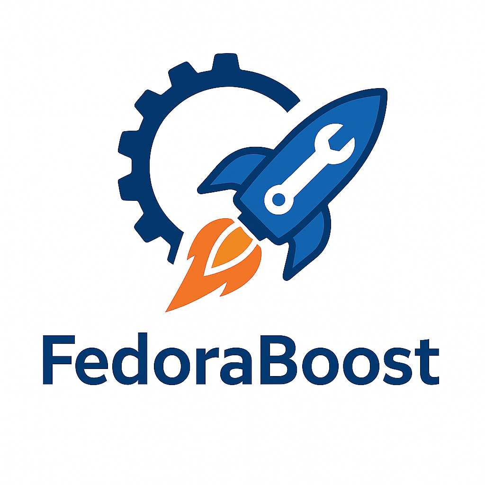

# 🐧 FedoraBoost

<div align="center">
  
</div>

Welcome to **FedoraBoost** — an open-source collection of scripts to **automate your Fedora Linux post-install setup**. Think of it as your one-stop toolkit for drivers, tweaks, theming, and more 🚀.

---

## ✨ What FedoraBoost Does

* ⚡ **One-click setup** with `install.sh`
* 🎨 **Theming made simple** — icons, cursors, wallpapers, fonts, GNOME settings, and even grub theming
* 🛠️ **System tweaks** — handy defaults and performance improvements
* 🖥️ **NVIDIA support** — automatic driver install + Secure Boot handling
* 🐟 **Fish shell configuration** — a cleaner, more powerful terminal
* ⌨️ **Custom shortcuts** — built-in productivity boosts
* 📦 **Repository setup** — adds the right package sources automatically

---

## 🚀 Getting Started

1. Clone the repo:

   ```bash
   git clone --depth 1 https://github.com/nalinduash/FedoraBoost.git
   cd FedoraBoost
   ```

2. Run the installer:

   ```bash
   chmod +x install.sh
   ./install.sh
   ```

That’s it! The script will guide you through the setup process.

---

## 📦 Apps You Can Choose To Install

Here are the apps you can pick when running this script. Each one has a short and simple meaning so you know what it does:

👨‍💻 Developer
   
* git – Helps you save and share code.

* vim – A fast text editor inside the terminal.

* python3 – A language to make programs.

* python3-pip – Adds extra tools for Python.

* nodejs – Lets you run JavaScript outside the browser.

* npm – Gets and manages JavaScript tools.

📂 Productivity

* libreoffice – Like Microsoft Office, but free.

🧑 Normal User

* video-downloader – Saves videos from the internet.

* Zoom – Online video calls and meetings.

* Mission-Center – Shows how your computer is working (CPU, RAM, etc.).

* Gear-Lever – Manage special portable apps (AppImages).

* Etcher – Create bootable USB/Pen drives

🌍 Common

* Ulauncher – Lets you open apps quickly and more

* VLC – Plays videos and music.

* ark – Opens and creates zip/rar files.

🎨 Creative

* gimp – Edit pictures and photos.

* inkscape – Make logos and drawings.

* blender – Create 3D models and animations.

* krita – Paint and draw digitally.

* audacity – Record and edit sounds.

* obs-studio – Record your screen or stream online.

* kdenlive – Edit videos easily.

⚙️ System Tools

* btop – Shows CPU, RAM, and what’s running.

* gparted – Helps split and manage disks.

* curl – Downloads stuff from the internet.

* wget – Another way to download files.

🎮 Gamer

* lutris – Helps install and play games on Linux.

## 🛡️ Disclaimer

* FedoraBoost scripts are provided **as-is**. Review them before running (recommended 👀).
* Built for **Fedora Workstation**, but parts may be reusable on other distros with tweaks.

---

## 🤝 Contributing

We love contributions! 💙

* Found a bug? Open an issue.
* Have a neat tweak, theme, or feature? Open a PR.
* Just want to chat? Start a discussion.

FedoraBoost is community-driven — the more ideas, the better 🎉.

---

## 📜 License

Licensed under the [Apache License 2.0](LICENSE).
